# Jarkom_Modul1_Lapres_E11

## Soal no. 1

Sebutkan webserver yang digunakan pada "testing.mekanis.me"!

Melakukan filter di display filter menggunakan "http.host == testing.mekanis.me"  akan keluar hasil sebagai berikut:

### screenshot filter

setelah itu klik dan follow > tcp stream. 

Akan didapatkan hasil sebagai berikut:

### screenshot follow

Dan dibagian server akan terlihat webserver yang digunakan oleh "testing.mekanis.me".

## Soal no. 2

Simpan gambar "Tim_Kunjungan_Kerja_BAKN_DPR_RI_ke_Sukabumi141436.jpg"!

Langkah pertama adalah memilih tab file setelah itu pilih yang export object 

Filter dengan kata "tim", lalu tinggal memilih image yang diinginkan pada soal, seperti pada SS dibawah ini.

### screenshot export object

Setelah itu kita tinggal menyimpan gambar yang diinginkan. Berikut adalah gambar dari file JPG yang disimpan:
### screenshot file yang di inginkan

## Soal no. 3

Cari username dan password ketika login di "ppid.dpr.go.id"!

Filter dengan command filter "http.request.method == POST" 
Klik pada hasil pencarian dan expand pada bagian yang bertuliskan "HTML Form URL..." 
Pada kolom form item username dan password sudah tertera username "10pemuda" dan pass "guncangdunia" . 
Screenshotnya seperti di bawah ini.

### screenshot hasil filteran

## Soal no. 4

Temukan paket dari web-web yang menggunakan basic authentication method!

Menggunakan command filter "http.authbasic", akan muncul semua web yang menggunakan basic authentication method, seperti gambar di bawah ini.

### screenshot hasil filter
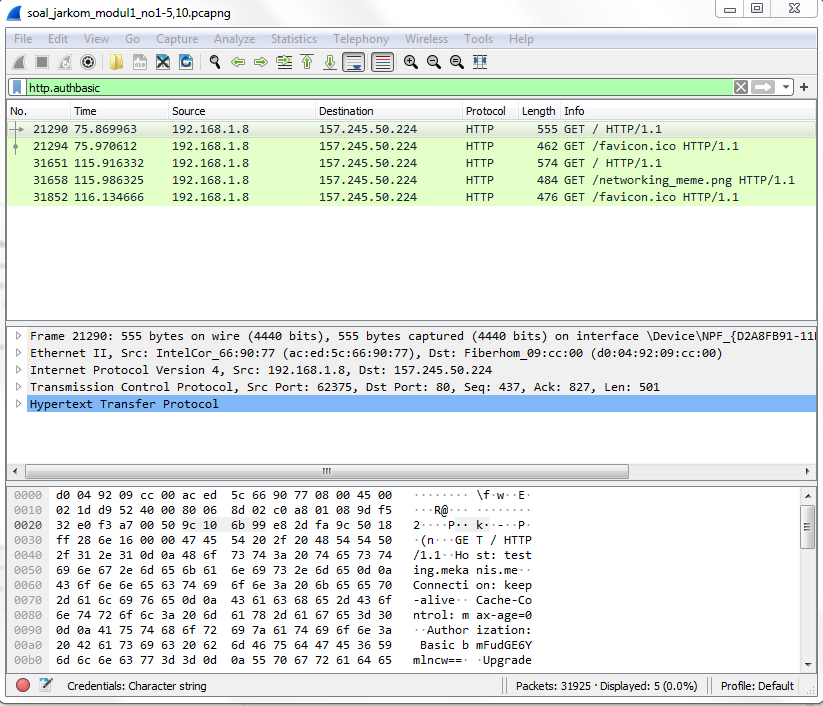
Gambar diatas adalah web-web yg menggunakan basic authentication method.

## Soal no. 5

Ikuti perintah di aku.pengen.pw! Username dan password bisa didapatkan dari file .pcapng!

Buka website "aku.pengen.pw" secara langsung dengan browser. Pada website tersebut akan diminta password dan username untuk melanjutkan.
Cari password dan username dengan memasukan command filter 'http.host == "aku.pengen.pw" '. 
Setelah itu, pilih salah satu hasil dan buka 'hypertext ....' dan extend lagi pada bagian 'authorization', dan di credentials akan terlihat username (kakakgamtenk) dan pass (hartatahtabermuda).
SS nya seperti di bawah ini.

### screenshot hasil

Dan seperti gambar di atas ketika memasuki web akan ada pertanyaan seperti di screenshot. Kita isi dan SS jawaban pertanyaan tersebut.

## Soal no. 6

Seseorang menyimpan file zip melalui FTP dengan nama "Answer.zip". Simpan dan Buka file "Open This.pdf" di Answer.zip. Untuk mendapatkan password zipnya, temukan dalam file zipkey.txt (passwordnya adalah isi dari file txt tersebut).

* Pertama kita mencari zip nya dengan cara. tekan ctrl + f atau tombol berikut . Ubah setting find menjadi string dan masukkan 'Answer.zip' (case sensitive). 
* Klik kanan hasil pada hasil pencarian dan pilih 
follow > tcp stream
* Save file as raw. Dan jangan lupa diberi ext berupa".zip". 

	Ketika file .zip dibuka akan terdapat file PDF, tetapi dibutuhkan password untuk membukanya. Password yang dibutuhkan terdapat di zipkey.txt, dan untuk mencari pass dapat dilakukan cara berikut:

* ctrl + f , cari 'zipkey.txt'.
* Setelah itu klik kanan dan follow setelah itu akan muncul passnya seperti ini. 

### Pass dari pdf

setelah itu buka pdf menggunakan pass yang didapat, dan akan muncul gambar seperti di bawah ini:

### Gambar di dalam pdf

## Soal no. 7

Ada 500 file zip yang disimpan ke FTP Server dengan nama 1.zip, 2.zip, ..., 500.zip. Salah satunya berisi pdf yang berisi puisi. Simpan dan Buka file pdf tersebut.
Your Super Mega Ultra Rare Hint = nama pdf-nya "Yes.pdf"

* Pertama gunakan ctrl + f, ubah menjadi string setelah itu cari 'Yes.pdf'
* Setelah itu klik kanan hasil dan ubah menjadi raw dan lakukan opsi save as. 
* Ketika pdf dibuka akan muncul gambar seperti di bawah ini

### Hasil dari ctrl + f dan isi pdf
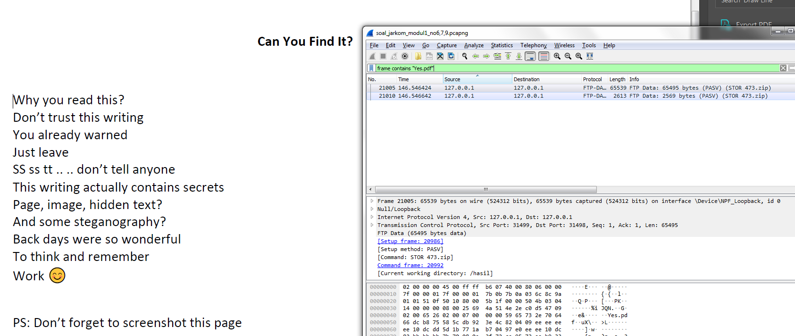

## Soal no. 8

Cari objek apa saja yang didownload (RETR) dari koneksi FTP dengan Microsoft FTP Service!

* Kita masukan command filter berikut 'ftp.request.command == RETR'
* Setelah itu akan muncul seperti gambar di bawah ini: 

### Gambar hasil command filter
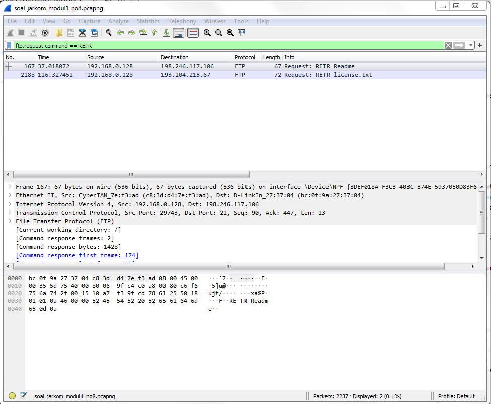

* Setelah itu klik kanan dan follow untuk mencari mana yang menggunakan microsoft FTP service, seperti gambar di bawah ini:
 
 ### Gambar hasil follow
 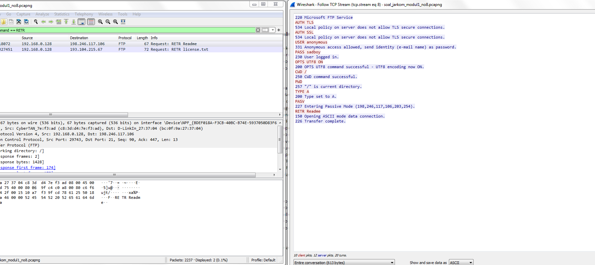
 * Seperti gambar di atas bahwa microsoft FTP service terdownload Readme

 ## Soal no. 9

 Cari username dan password ketika login FTP pada localhost!

* Kita memasukan command filter 'ftp.request.command == USER'. Dan user akan muncul seperti gambar di bawah ini.

### User 

* Masukan command filter 'ftp.request.command == PASS', dan pass akan muncul seperti di bawah ini:

### Pass
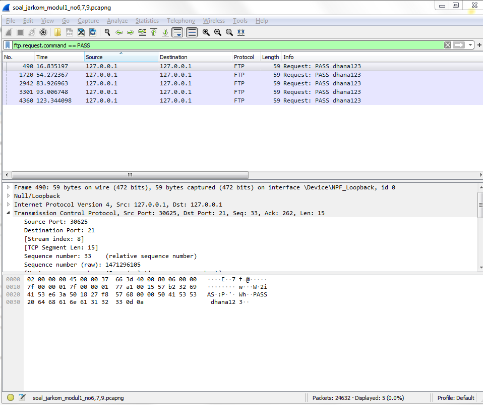

* dari 2 hasil di atas didapatkan.
* username nya adalah 'dhana' dan pass nya adalah 'dhana123'

## Soal no. 10

Cari file .pdf di wireshark lalu download dan buka file tersebut!
clue: "25 50 44 46" 

* Gunakan CTRL + f dan masukan clue yang diberikan, dan jangan lupa untuk mengubah pencarian berdasarkan HEX value , seperti gambar di bawah ini:

### Find SS
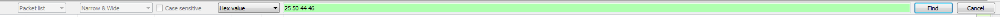

* setelah itu klik kanan dan follow lalu ubah menjadi raw dan lakukan save as. 
* Isi dari pdf tersebut adalah dokumen di bawah ini:

### Isi PDF
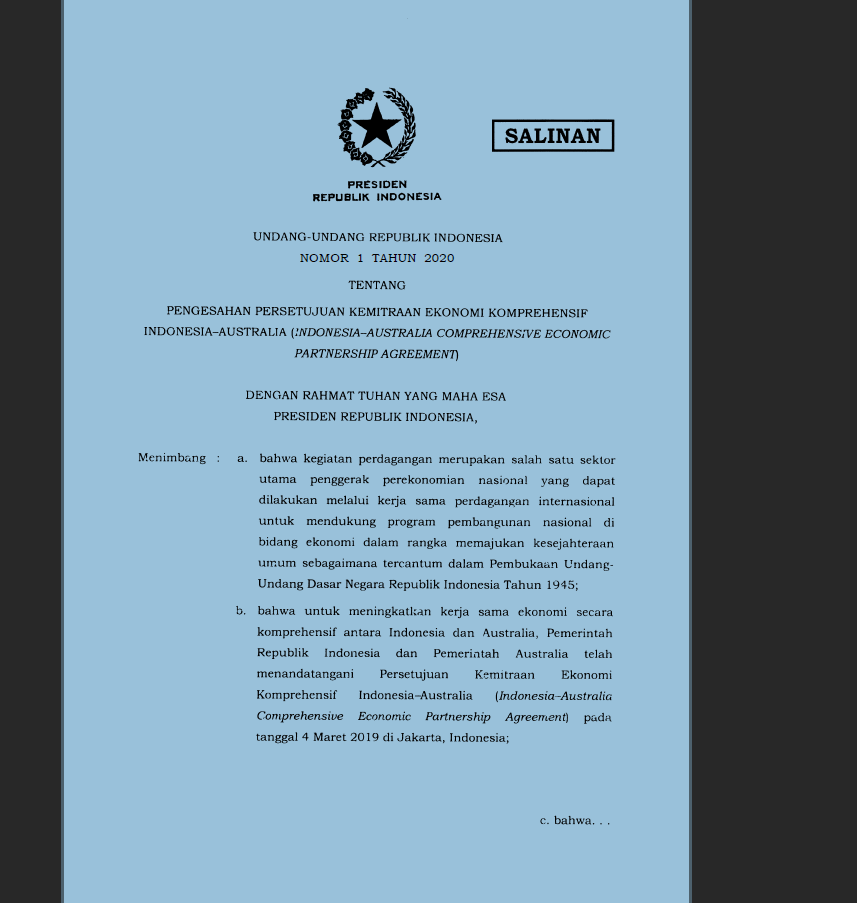

<h3>Untuk soal no 11-15 command filter dilakukan di capture filter</h3>

## Soal No. 11

Filter sehingga wireshark hanya mengambil paket yang mengandung port 21!

* Masukan command filter 'port 21'

* Hasil seperti gambar dibawah ini

### Filter port 21
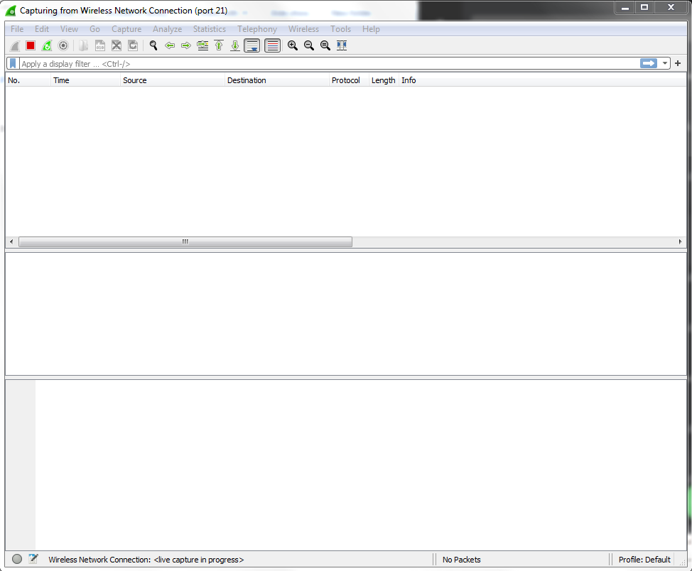 

## Soal no. 12

Filter sehingga wireshark hanya mengambil paket yang berasal dari port 80!

* Masukan command filter 'src port 80'

* Hasil seperti gambar dibawah ini

### Filter port 80
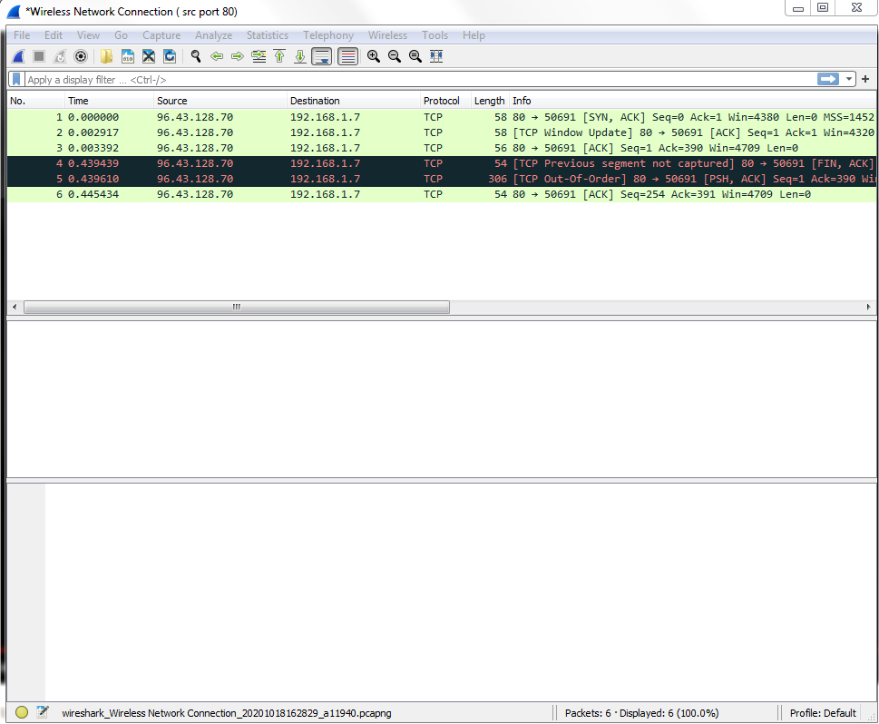

## Soal no.13

Filter sehingga wireshark hanya menampilkan paket yang menuju port 443!

* Masukan command filter 'dst port 443'

* Hasil seperti gambar dibawah ini

### Filter yang menuju port 443
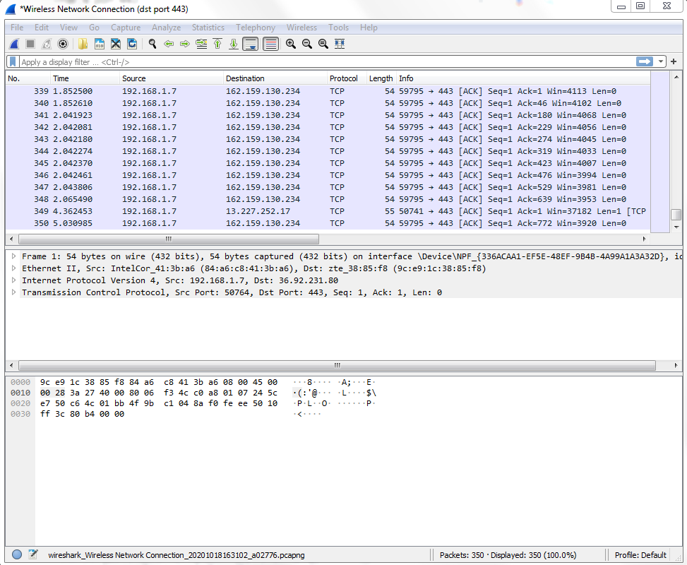

## Soal no. 14

Filter sehingga wireshark hanya mengambil paket yang berasal dari ip kalian!

* Klik lambang wifi dan cari wifi yang kita connect
* Setelah itu klik kanan dan klik status
* setelah itu klik detail
* dan di samping IPv4 adress adalah IP adress kita

* setelah itu masukan command filter 'ip src "IP adress kita" '
* Hasilnya seperti gambar dibawah ini

### Hasil paket berasal dari IP
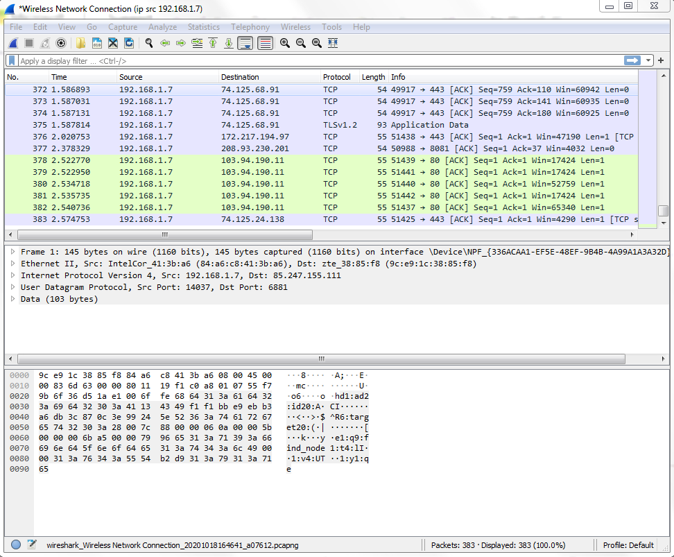

## Soal no. 15

Filter sehingga wireshark hanya mengambil paket yang tujuannya ke monta.if.its.ac.id!

* Masukan command filter 'dst host monta.if.its.ac.id'
* Hasil seperti gambar dibawah ini

### Paket bertujuan ke monta.if.its.ac.id

### Permasalahan Selama Mengerjakan
#1) Soal terlambat muncul
Karena sebab yang tidak diketahui, soal belum muncul meskipun halaman telah direfresh

