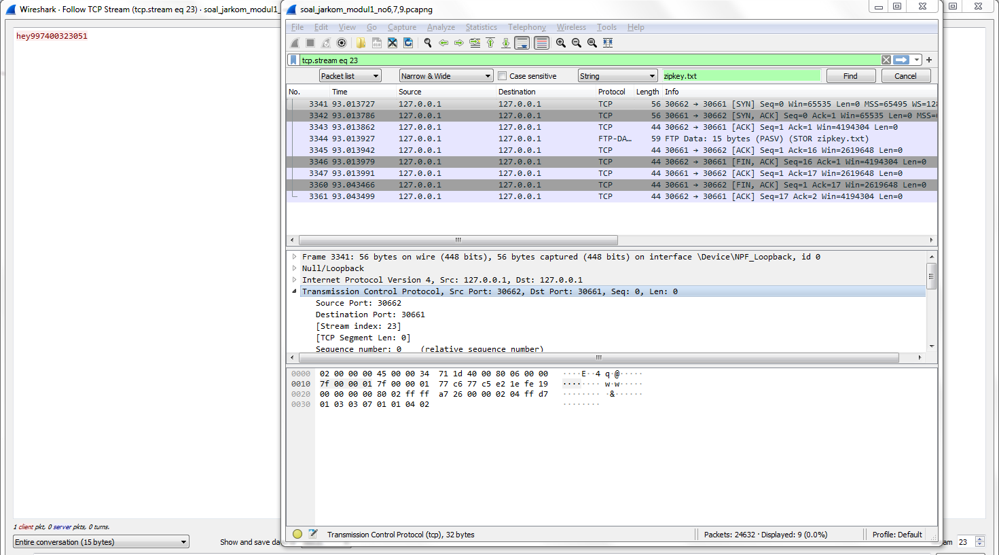
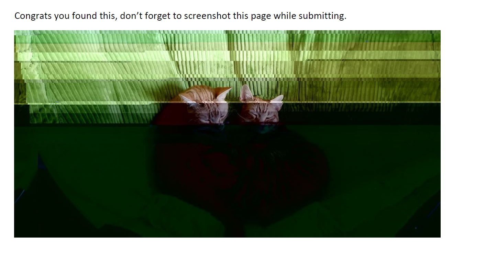

# Jarkom_Modul1_Lapres_E11

## Soal no. 1

Sebutkan webserver yang digunakan pada "testing.mekanis.me"!

Melakukan filter di display filter menggunakan "http.host == testing.mekanis.me" dan akan keluar hasil seperti ini.

### screenshot filter

setelah itu klik dan follow > tcp stream. Dan hasilnya akan seperti ini

### screenshot follow

Dan dibagian server akan terlihat webserver yang digunakan oleh "testing.mekanis.me".

## Soal no. 2

Simpan gambar "Tim_Kunjungan_Kerja_BAKN_DPR_RI_ke_Sukabumi141436.jpg"!

Langkah pertama adalah memilih tab file setelah itu pilih yang export object dan filter dengan kata tim setelah itu kita tinggal memilih image yang di inginkan pada soal. Seperti pada SS dibawah ini.

### screenshot export object

Setelah itu kita tinggal menyimpan gambar yang di inginkan. dan filenya adalah gambar yang dibawah ini

### screenshot file yang di inginkan

## Soal no. 3

Cari username dan password ketika login di "ppid.dpr.go.id"!

filter dengan command filter "http.request.method == POST" 
setelah itu klik hasilnya dan expand yang bertuliskan "HTML Form URL..." 
di kolom form item usernam dan pass sudah tertera username "10pemuda" dan pass "guncangdunia" . 
Screenshotnya seperti dibawah ini.

### screenshot hasil filteran

## Soal no. 4

Temukan paket dari web-web yang menggunakan basic authentication method!

menggunakan command filter "http.authbasic". Dan akan muncul semua web yang menggunakan basic authentication method. SS seperti dibawah ini.

### screenshot hasil filter

Gambar diatas adalah web-web yg menggunakan basicc authentication method.

## Soal no. 5

Ikuti perintah di aku.pengen.pw! Username dan password bisa didapatkan dari file .pcapng!

langsung membuka website "aku.pengen.pw". Di website tersebut diminta pass dan username. 
Setelah itu mencari pass dan username dengan memasukan command filter 'http.host == "aku.pengen.pw" '. 
Setelah itu memilih salah satu hasil dan membuka 'hypertext ....' dan meng extend lagi 'authorization' dan di credentials keluar username dan pass.
SS nya seperti dibawah ini.

### screenshot hasil

Dan seperti gambar di atas ketika memasuki web akan ada pertanyaan seperti di screenshot. Kita isi dan SS jawaban pertanyaan tersebut.

## Soal no. 6

Seseorang menyimpan file zip melalui FTP dengan nama "Answer.zip". Simpan dan Buka file "Open This.pdf" di Answer.zip. Untuk mendapatkan password zipnya, temukan dalam file zipkey.txt (passwordnya adalah isi dari file txt tersebut).

* Pertama kita mencari zip nya dengan cara. tekan ctrl + f setelah itu ubah setting find nya menjadi string dan masukan 'Answer.zip' (case sensitive). 
* Setelah itu kita klik kanan hasil nya dan pilih 
follow > tcp stream
* Setelah itu save file as raw. Dan jangan lupa ext ".zip" nya. 

	Ketika kita buka terdapat PDF tetapi tidak bisa dibuka jika tidak ada pass nya. dan pass nya terdapat di zipkey.txt untuk mencari pass nya caranya sebagai berikut.

* ctrl + f , cari 'zipkey.txt'.
* Setelah itu klik kanan dan follow setelah itu akan muncul passnya seperti ini. 

### Pass dari pdf

setelah itu kita kita buka pdfnya menggunakan pass nya dan akan mendapatkan gambar seperti dibawah ini.

